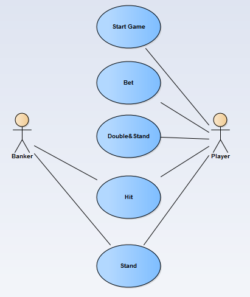
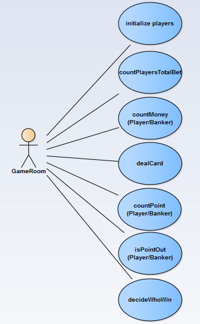

# BlackJack

cww97 和 甜心 的 OOAD Project

working.....

## BackGround

Firstly, to be aware of how BlackJack works, we did some research on [4399](www.4399.com). We saw too many brilliant GUI. Our instructor, however, told us UI is not so significant as our design because this course is called 'OOAD', which emphasizes Analysis & Design. As a result, in our first edition, we made our users to play the game with a console. What's more, many players play one game in one PC is stupid, so, we have only one player in our first edition. 

## Domain Model

## Class Model

The following is our introduction for every class:
Class Card：This class has four attributes,hashNum,value,flower,number.Because the attribute flower doesn't have any usage in comparing handcard's value between player and banker,we abandon this attribute.We use ...方式计算牌的值。

Class HandCard:It's inheritancing from Card.It can calculate cards's value which are in hand....

Class Deck:It's describe the card's characteristics.It's mainly to generate a pokercard for players to use.what's more,it can wash card,deal card and so on.

Class Person:It mainly contains players's and bankers's shared attributes and operates for them to inheritance to reduce unnecessary code.

Class Player:Attribute bet is to record bet money.Attribute Money is to record remained money.

Class Banker:It has a method to decide whether banker has to hit or not.

Class GameRoom:It realizes functions that initialize GameTable and Players and begins the game.

Class GameTable:It encapsulates many methods.

Like money and betmoney the two attributes,they can't be a class.Because they doesn't have their own attributes and operates.

## Use Case Model

### 1

### 2

## System Sequence Diagram

### Player

### Banker

###Operation Contracts
Player：

Contract CO1:init
operation：init()
cross reference：begin game
precondition：system is going normally
postcondition：player is already to play this game

Contract CO2:playerBet
operation：playerBet()
cross reference：do bet
precondition：game begins and player is already
postcondition：system records player's bet and his remained money updates

Contract CO3:dealOneCardToPlayer
operation：dealOneCardToPlayer()
cross reference：hit
precondition：player's hand-card's total value is under 21 and player wants to hit
postcondition：a new card adds to player's hand-card and hand-card's value updates
    
Contract CO4:directlystop
operation:no operation and break directly
cross reference：directly end
precondition：player's hand-card's total value is under 21 and player wants to stop getting another card
postcondition：player's turn is over

Contract CO5:playerDouble
operation：playerDouble()
cross reference：double and end
precondition：player's hand-card's total value is under 21 and player wants to double the bet and stop getting another card
postcondition：system records player's bet to double and his remained money updates and player's turn is over

Banker:

Contract CO1:decide whether player's turn is over
operation：no opetation
cross reference：no 
precondition：game is going normally
postcondition：banker's turn is beginning

Contract CO2:dealOneCareToBanker
operation：dealOneCareToBanker()
cross reference：hit
precondition：banker's hand-card's value is under 17
postcondition：a new card adds to banker's hand-card and hand-card's value updates

Contract CO3:directlystop
operation：no operation and break directly
cross reference：end
precondition：banker's hand-card's value is not under 17
postcondition：banker's turn is over and system begins to decide who is the winner

##Summary
This lab is not only exercises our logical thinking ability but also strengthen our abilities of OOAD.We tasted sour and bitter ,sweet and happiness in this lab.We found the joy of analysis&design and inspired our passion to do the best.Thanks to this lab,we learn more new things and reinforce our knowledge.We love BlackJack!We love OOAD. 