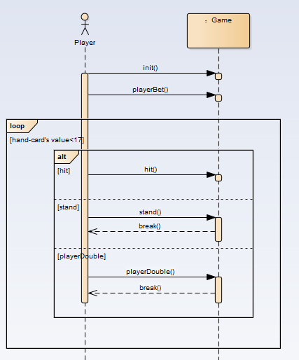

# BlackJack

 

East China Normal University

Computer Science & Software Energeering College

Grade 2015

 [Weiwen Chen 10152510217](https://github.com/cww97)

 [Haoqian You 10152510210](https://github.com/YvonneYou)

https://github.com/LittleSweetHeart/BlackJack

## BackGround

Firstly, to be aware of how BlackJack works, we did some research on [4399](4399.com). We saw too many brilliant GUI. Our instructor, however, told us UI is not so significant as our design because this course is called 'OOAD', which emphasizes Analysis & Design. As a result, in our first edition, we made our users to play the game with a console. What's more, many players play one game in one PC is stupid, so, we have only one player in our first edition. 

## Domain Model


## Class Model


The following is our introduction for every class:

**`Class Card`:** This class has four attributes, `hashNum`, `value`, `flower`, `number`. However only two of them have meaning. The `flower` and `number` are two arraies of const. Because the attribute flower doesn't have any usage in comparing handcard's value between player and banker, we abandon this attribute. As we all know, a pack of cards has 52 cards(drop the Jokers). We number them from 0 to 51, which is called hashNumber(attribute `hashNum`). `hashNum / 4 + 1` is this card's value, and `hashNum % 4` is No of its suits(`flower[hashNum % 4]` is the suit string of this card). So at first our deck are arranged like this: '♥A, ♦A, ♠A, ♣A, ♥2, ♦2, ♠2, ♣2, ♥3, ♦3, ♠3, ♣3 ....', for card 'A', in different conditions it has different values, and to display it we need `A` instead of `1`, we have a special method to handle this. Another const array `number`, this is only to dis three cards `J Q K`, their value(calc by hashNum algorithm) is `11, 12, 12`, respectively. However, in `BlackJack Game`, we make their value to `10, 10, 10`, which is managed in function `countTotalPoint()`.

**`Class HandCard`:** It is inheritancing from Card. It can calculate cards's value which are in person's hand. We matain a `List` of `Card` here, which is called `CardList`, to express the cards in person's hand.

**`Class Deck`:** It is describe the card's characteristics. It is mainly to generate a pokercard for players to use. what's more, it can wash card, deal card and so on. What we need to say more here is, the function`WashCard` and how we deal cards. To wash our deck, we randomly choose two cards, the swap them(I have to say, `C#` does not have its own `swap()` method, which is really stupid = =). We do this operation for many times, which simulates the process of washing cards. Then we always select card from the top of the deck.

**`Class Person`:** It mainly contains players's and bankers's shared attributes and operates for them to inheritance to reduce unnecessary code. Both player and banker have `HandCard`, so it is here. They both have names, even if this does not really meaningful.

**`Class Player`:** This class is inherited from `Class Person`. Attribute bet is to record bet money. Attribute Money is to record remained money.

**`Class Banker`:** This class is also inherited from `Class Person`. It has a method to decide whether banker has to hit or not. The difference between player and banker is, the player has money limits, where the banker does not.

**`Class GameTable`:** This class contains almost all class above. Oh actually we have three: `Player`, `Banker`, `Deck`, which make up a `BlackJack Game`. A great many methods are here to simulate the operations in a game, such as `deal card`, `get money`, etc. Aditionally, `Class GameRoom` mostly communicates with this class.

**`Class GameRoom`:** Image that you enter a room of `BlackJack Game`. You need to talk to the `System`. It realizes functions that initialize GameTable and Players and begins the game. If we want to a Gamelobby in the future, turn `gameTable` into `gameTables[]`.

Like money and betmoney the two attributes, there is no need for them to become a class, for the reason that they does not have their own attributes and operates and a simple `int` has ability to express them.


## Use Case Model


### Use Case Description


User Case UC1:| Play Game
:---|:---
Scope:| BlackJack Game
Level:| User Goals
Main Actor:| Player,Banker
Stakeholders and Concerns:| Player:wants to win the game.Banker:also wants to win the game.
Main successful scene:| 1、Player requests to initialize a new game2、Player bets 3、Player gets two cards 4、Player decides to hit ,stand or double&stand 5、If player's hand-card's value is over 21,player loses,game over 5、Until player stands ,it turns to banker's turn.Banker will hit when his hand-card'value is under 17 6、If banker's hand-card's value is over 21 ,banker loses,game over 7、Else to compare player's and banker's hand-card's value to show the result
Extension:| a. in any time, if this system failed: 1.the system can be restarted, and recover the data.

## System Sequence Diagram

### Player



### Banker


### Operation Contracts

#### Player：


Contract CO1:| init
:---|:---
operation：| init()
cross reference：| begin game
precondition：| system is going normally
postcondition：| player is already to play this game

Contract CO2: |playerBet
:---|:---
operation：| playerBet()
cross reference：| do bet
precondition：| game begins and player is already
postcondition：| system records player's bet and his remained money updates

Contract CO3: | dealOneCardToPlayer
:---|:---
operation: | dealOneCardToPlayer()
cross reference：| hit
precondition：| player's hand-card's total value is under 21 and player wants to hit
postcondition：|a new card adds to player's hand-card and hand-card's value updates


Contract C04: | Stand()
:---|:---
operation: | Stand()
cross reference：| directly end
precondition：| player's hand-card's total value is under 21 and player wants to stop getting another card
postcondition：| player's turn is over

Contract CO5: | playerDouble
:---|:---
operation：| playerDouble()
cross reference：| double and end
precondition：| player's hand-card's total value is under 21 and player wants to double the bet and stop getting another card
postcondition：| system records player's bet to double and his remained money updates and player's turn is over


#### Banker:

Contract CO1: | decide whether player's turn is over
:---|:---
operation：| no opetation
cross reference：| no 
precondition：| game is going normally
postcondition：| banker's turn is beginning

Contract CO2: | dealOneCareToBanker
:---|:---
operation: | dealOneCareToBanker()
cross reference：| hit
precondition：| banker's hand-card's value is under 17
postcondition：| a new card adds to banker's hand-card and hand-card's value updates

Contract CO3: | directlystop
:---|:---
operation：| no operation and break directly
cross reference：| end
precondition：| banker's hand-card's value is not under 17
postcondition：| banker's turn is over and system begins to decide who is the winner

## Display

We do not have GUI here, because our instructor said that is not important(The real reason is we are lazy).

Example1

	来啊，快活啊，反正有，大把时光= =
	Please enter your name:
	sweet
	Welcome, sweet
	现在您已坐在 BlackJack 的桌前， 来一盘吗（y/n）
	y
	您的余额为： 1000, 请下注：
	1000
	得到一张牌: 黑桃 10
	得到一张牌: 红桃 6
	您有三种选择：stand(直接结束), hit(继续要牌), double(加倍结束).
	输出(s/h/d)进行您的选择：
	d
	钱不够加倍了，请做其他选择
	您的点数为 16
	--------您的表演结束了---------
	庄家爆牌了，输了输了
	庄家手牌为：红桃 7梅花 9梅花 8
	发生这种事，我很抱歉。
	现在余额为0
	再来一轮？
	n
	Goodbye.

Example2

	您的余额为： 1000, 请下注：
	1000
	得到一张牌: 方片 6
	得到一张牌: 梅花 4
	您有三种选择：stand(直接结束), hit(继续要牌), double(加倍结束).
	输出(s/h/d)进行您的选择：
	h
	得到一张牌: 梅花 A
	您有三种选择：stand(直接结束), hit(继续要牌), double(加倍结束).
	输出(s/h/d)进行您的选择：
	s
	您的点数为 21
	--------您的表演结束了---------
	庄家手牌为：梅花 2红桃 5黑桃 2红桃 10
	赌神你好。。
	现在余额为2000


## Requirements Change


## Changes for  Design

### Domain Model's change


The `GameRoom` can initialize one or even more `Player` now.

### Class Model's change


I will list the changed classes and give some illustrations.

**`Class Deck`:** We make a new operation called `Throw2Cards` to meed the requirement 1.

**`Class GameTable`:** In this class ,we  declare a array `Player[]` to control multiplayer. Besides,we declare a static constant `BREAK_POINT` for manager to  revise the conditions of win and lose. `AllBet()` for players to add Bet, which is easy to understand.

**`Class GameRoom`:** Reconstruct the method `play()`, and to make it easy to understand, we split some sentences of it into small functions.

**`Class Player`:** A new method `addBet()`

**`Class HandCard`:** We declare a static constant `BREAK_POINT` to judge point-out or not. 

## Use Case Model has no change


### Use Case Description's change

User Case UC1:| Play Game
:---|:---
Scope:| BlackJack Game
Level:| User Goals
Main Actor:| Player,Banker
Stakeholders and Concerns:| Player:wants to win the game.Banker:also wants to win the game.
Main successful scene:| 1、Players request to initialize a new game2、Player bets 3、Player gets two cards 4、Player decides to hit ,stand or addBet 5、If player's hand-card's value is over 22,player loses,game over 5、Until all players stand ,it turns to banker's turn.Banker will hit when his hand-card'value is under 17 6、If banker's hand-card's value is over 22 ,banker loses,game over 7、Else to compare player's and banker's hand-card's value to show the result.
Extension:| a、in any time,if this system failed:1、the system can be restarted,and recover the data.

## System Sequence Diagram's change

### Player


We add a new operation called `addBet()` to meet the requirement,adding bet when players play the game.

### Banker


Here is no change.

### Operation Contracts

#### Player：

Contract CO6: | addBet
:---|:---
operation：| addBet()
cross reference：| add bet
precondition：| player's money is enough
postcondition：| system records player's added bet and his remained money updates ,then player can choose to hit or stand.

#### Banker：

Here is no change.

## Code Solution

### 1. Only 50 cards left(throw 2 cards)

From the first version we can see that, we radomly select two card and then swap them. Repeating this operation many time we can simulate the process of washing cards. In `Deck.cs`, we have a currentIndex which means cards before it has been taken, so if we need to throw 2 cards, we just need to add one function here, and it is pretty easy to realize.

```c#
// requirement change1
public bool Throw2Cards()
{
    currentIndex += 2;
    return currentIndex < cardCnt;
}
```

Call it at the end of `Deck()`, then we realize the operation of throwing 2 cards. get it.

### 2. We can add bet during playing

do some changes on `play()`

I feel the origin 'double'(ask for one more card, make bet double, then over) is pretty stupid. Because we `AddBet()` and `Hit()` can do this. So I replace it with the operation `AddBet()`, which is need in the ppt.

```c#
private void AddBet(int playerIdx)
{
    Console.WriteLine("Your Cash: " + g.getPlayerBet(playerIdx) + "/" + g.getPlayerMoney(playerIdx));
    Console.WriteLine("How much bet do you want to add?");
    int addMoney = Convert.ToInt32(Console.ReadLine());
    Console.WriteLine("addMoney == " + addMoney);
    if (g.AddBet(playerIdx, addMoney)){
        Console.WriteLine("加注成功，Now: " + g.getPlayerBet(playerIdx) + "/" + g.getPlayerMoney(playerIdx));
    }
    else{
        Console.WriteLine("余额不足，加注失败");
    }
}
```

To make it more grace, We reorganized `play(playerIdx)`, Here is the loop:

```c#
// 由玩家决定是否继续
for (int i = 0; i < 999; i++) {
    Console.WriteLine("您有三种选择：1.stand(直接结束), 2.hit(继续要牌), 3.增加赌注.");
    Console.WriteLine("输出(1/2/3)进行您的选择：");
    int op = Convert.ToInt32(Console.ReadLine());
    if (op == 1) break;
    else if (op == 2) { 
        if (Hit(playerIdx)) break;
    } else if (op == 3) { 
        AddBet(playerIdx);
    } else { 
        Console.WriteLine("输入错误，请重新输入.");
    }
}
```

Repeat it many times, until player point out or player choose to `stand()`(because we have nothing to do in stand, so we only have a `break` to express 'stand()').

### 3. Win/Lose Condition: 22 -> 21

We declare a static constant named BREAK_POINT.It's easy for us to amend the conditions of winning and losing with this static constant.

```c#
private const int BREAK_POINT = 22;
```

### 4. Remove all cards whose suit is ♠

We need to do some change in `Deck.cs` to satisfy this requirement. Let us see how we arrange our cards:

>**`Class Card`:** This class has four attributes, `hashNum`, `value`, `flower`, `number`. However only two of them have meaning. The `flower` and `number` are two arraies of const. Because the attribute flower doesn't have any usage in comparing handcard's value between player and banker, we abandon this attribute. As we all know, a pack of cards has 52 cards(drop the Jokers). We number them from 0 to 51, which is called hashNumber(attribute `hashNum`). `hashNum / 4 + 1` is this card's value, and `hashNum % 4` is No of its suits(`flower[hashNum % 4]` is the suit string of this card). So at first our deck are arranged like this: '♥A, ♦A, ♠A, ♣A, ♥2, ♦2, ♠2, ♣2, ♥3, ♦3, ♠3, ♣3 ....', for card 'A', in different conditions it has different values, and to display it we need `A` instead of `1`, we have a special method to handle this. Another const array `number`, this is only to dis three cards `J Q K`, their value(calc by hashNum algorithm) is `11, 12, 12`, respectively. However, in `BlackJack Game`, we make their value to `10, 10, 10`, which is managed in function `countTotalPoint()`.

So, it is pretty easy. We only need to do insert some codes in `Deck()`, delete the cards whose `HashNum % 4 == 2`. Or, We just need ignore the `append()` operation when facing them(there is no `append()`, but you know what I am talking about).

Easy Game.
```c#
for (int i = 0; i < 52; i++){
    if (i % 4 == 2) continue;  // requirement change 4
    DeckCards[cardCnt++] = new Card(i);
}
```

### 5. PointOut: 21 -> 22

This is the same as the requirement change3. We donot need extra change.

```c#
private const int BREAK_POINT = 22;
```
### 6. Multiplayer

We thought about this question before. So our `GameTable.cs` do not have only one `Player`. What we have is `Players[]`. However, in our first version, we only have this code `int playerPoint = Play(0);`. After that we compare this player's point with banker's. Now we need a little change of the `GameRoom`. We may need a `for` loop to get this.

Single Player(Origin):
```c#
int playerPoint = Play(0);
if (g.Players[0].isBlackJack()) {
    Console.WriteLine("BlackJack!!!");
    playerWin(0);
} else if (playerPoint == -1) {
    playerLose(0);
} else {
    if (bankerPoint == -1) playerWin(0);
    else {
        if (bankerPoint < playerPoint) playerWin(0);
        else playerLose(0);
    }
}


```

MultiPlayer(Now):

```c#
int Init() {
	Console.WriteLine("欢迎来到BlackJack");
	Console.WriteLine("请输入玩家人数：");  // requirement change 6
	int playCnt = Convert.ToInt32(Console.ReadLine());
	Player[] p = new Player[playCnt];
	for (int i = 0; i < playCnt; i++){
 		Console.WriteLine("Player" + (i+1) + "Please enter your name:");
  		p[i] = new Player();
		p[i].Name = Console.ReadLine();   
    }
    g.Players = p;
    Console.WriteLine("Welcome, Now we begin our Game.");
    return playCnt;
}
```

### 7. MultiWinners

This part is the same with last one.


```c#
private void PlayersWin(int playCnt){
	Console.WriteLine("玩家胜利");
	int cnt = g.GetWinCnt(playCnt);
	for (int i = 0; i < cnt; i++){
		g.PlayerWin(i, cnt);
		Console.WriteLine(g.Players[i].Name + "胜利，余额为" + g.GetPlayerMoney(i));
    }
	for (int i = cnt; i < playCnt; i++){
		g.PlayerLose(i);
		Console.WriteLine(g.Players[i].Name + "失败，余额为" + g.GetPlayerMoney(i));
	}
}
```

### 8. Banker will be more likely to win

We made a simple design for the role:

If the players' point is the same as the bankers', We judge that 

```c#
int maxPlayerPoint = g.SortPlayers(playCnt);
if (maxPlayerPoint <= bankerPoint){ // banker win
    BankerWin(playCnt);
}else{ // players win
    PlayersWin(playCnt);
}
```

## Some Questions

### Point out

`GameTable.cs`

```c#
// Determine the point of player if out BREAK_POINT 
public bool IsPointOut(int playerNo){
    return players[playerNo].GetTotalPoint() == -1;
}

//Determine the point of Banker if out BREAK_POINT 
public bool IsBankerOut()
{
    return banker.GetTotalPoint() == -1;
}
```

`Person.cs`

```c#
public int GetTotalPoint()
{
    int ret = Hand.countTotalPoint();
    return ret <= 22 ? ret : -1;
}
```

Next part we will see `countTotalPoint()`

### Special Card A

Well handled.

```c#
//Compute Hand Card Point
public int countTotalPoint(){
    int totalPointCount = 0;
    foreach (Card card in cardList){
        int value = card.GetCardValue();
        totalPointCount += value;
    }
    foreach (Card card in cardList){
        //special card "A",deal with it
        if (card.GetCardValue() == 1){
            if (totalPointCount + 9 <= BREAK_POINT) totalPointCount += 9;
        }
    }
    return totalPointCount;
}
```

### No two the same cards.

We have talked clearly about our card hash system(0-51, one hashNum to one card). So we will not have two same cards.

see `Card.cs` for details

```c#
// 从牌的编号得到牌上的真实数字
private int countCardValue(int num){
    if (num >= 40) return 10;  // J Q K 都算 10
    return (num) / 4 + 1; // 111122223333....10101010
}

public String GetCardFace(){
    int hash = hashNum;
    String flo = flower[hash % 4];
    String num;
    if (hash < 4) num = "A";
    else if (hash < 40) num = (hash / 4 + 1).ToString();
    else num = number[(hash - 40) / 4];
    return flo + num + " ";
}
```

### Bet Calculate

`GameTalble.cs` has a `private int AllBet;`

```c#
public void PlayerBet(int idx, int bet){ // 保证兜里钱够
    players[idx].Bet.betNum = bet;
    AllBet += bet;
}

public bool AddBet(int p, int v)
{
    AllBet += v;
    return players[p].AddBet(v);
}
```

when players win

```c#
public void PlayerWin(int idx, int cnt){
    Console.WriteLine("AllBet = " + AllBet);
    players[idx].Win(AllBet/cnt);
}
```

From above, all question on ppt has been well handled, and in real-playing we didnot find such problems. 

## New Display

First display on cww's PC.


Second display on tx's laptop.


## Summary

This lab is not only exercises our logical thinking ability but also strengthen our abilities of OOAD. We tasted sour and bitter, sweet and happiness in this lab. We found the joy of analysis&design and inspired our passion to do the best. Thanks to this lab, we learn more new things and reinforce our knowledge. We love BlackJack! We love OOAD, GPA++. 

Now the only thing I want is, my hair.

 --> 

Version2 is not pretty hard, because we had done a great amount of jobs in our first version.

## Reference

1. UML和模式应用 https://book.douban.com/subject/1792387/

2. BlackJack(Baidubake) https://baike.baidu.com/item/21%E7%82%B9/5481683?fr=aladdin

3. BlackJack in 4399.com http://www.4399.com/flash/1096.htm

4. Another BlackJack http://www.docin.com/p-1432261295.html

5. 大话设计模式 https://book.douban.com/subject/2334288/