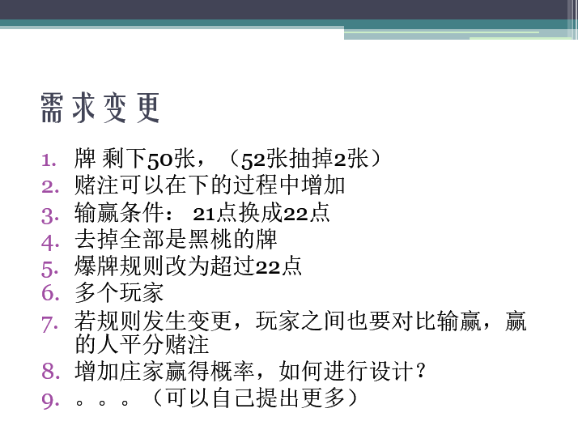
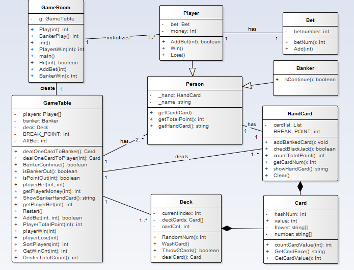
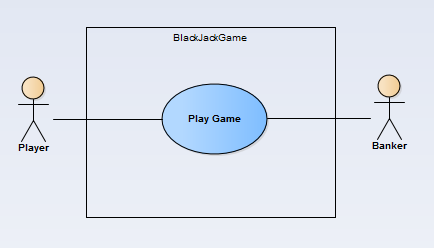
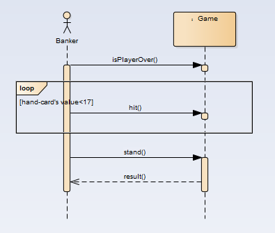

# BlackJack Requirement Change

## Changes of Requirements



## Changes for  Design

### Domain Model's change


The `GameRoom` can initialize one or even more `Player` now.

### Class Model's change



I will list the changed classes and give some illustrations.

**`Class Deck`:** We make a new operation called `Throw2Cards` to meed the requirement 1.
**`Class GameTable`:** In this class ,we  declare a array `Player[]` to control multiplayer. Besides,we declare a static constant `BREAK_POINT` for manager to  revise the conditions of win and lose. `AllBet()` for players to add Bet, which is easy to understand.
**`Class GameRoom`:** Reconstruct the method `play()`, and to make it easy to understand, we split some sentences of it into small functions.
**`Class Player`:** A new method `addBet()`
**`Class HandCard`:** We declare a static constant `BREAK_POINT` to judge point-out or not. 

## Use Case Model has no change



### Use Case Description's change

User Case UC1:| Play Game
:---|:---
Scope:| BlackJack Game
Level:| User Goals
Main Actor:| Player,Banker
Stakeholders and Concerns:| Player:wants to win the game.Banker:also wants to win the game.
Main successful scene:| 1、Players request to initialize a new game2、Player bets 3、Player gets two cards 4、Player decides to hit ,stand or addBet 5、If player's hand-card's value is over 22,player loses,game over 5、Until all players stand ,it turns to banker's turn.Banker will hit when his hand-card'value is under 17 6、If banker's hand-card's value is over 22 ,banker loses,game over 7、Else to compare player's and banker's hand-card's value to show the result.
Extension:| a、in any time,if this system failed:1、the system can be restarted,and recover the data.

## System Sequence Diagram's change

### Player


We add a new operation called `addBet()` to meet the requirement,adding bet when players play the game.

### Banker



Here is no change.

### Operation Contracts

#### Player：

Contract CO6: | addBet
:---|:---
operation：| addBet()
cross reference：| add bet
precondition：| player's money is enough
postcondition：| system records player's added bet and his remained money updates ,then player can choose to hit or stand.

#### Banker：

Here is no change.

## Code Solution

### 1. Only 50 cards left(throw 2 cards)

From the first version we can see that, we radomly select two card and then swap them. Repeating this operation many time we can simulate the process of washing cards. In `Deck.cs`, we have a currentIndex which means cards before it has been taken, so if we need to throw 2 cards, we just need to add one function here, and it is pretty easy to realize.

```c#
// requirement change1
public bool Throw2Cards()
{
    currentIndex += 2;
    return currentIndex < cardCnt;
}
```

Call it at the end of `Deck()`, then we realize the operation of throwing 2 cards. get it.

### 2. We can add bet during playing

do some changes on `play()`

I feel the origin 'double'(ask for one more card, make bet double, then over) is pretty stupid. Because we `AddBet()` and `Hit()` can do this. So I replace it with the operation `AddBet()`, which is need in the ppt.

```c#
private void AddBet(int playerIdx)
{
    Console.WriteLine("Your Cash: " + g.getPlayerBet(playerIdx) + "/" + g.getPlayerMoney(playerIdx));
    Console.WriteLine("How much bet do you want to add?");
    int addMoney = Convert.ToInt32(Console.ReadLine());
    Console.WriteLine("addMoney == " + addMoney);
    if (g.AddBet(playerIdx, addMoney)){
        Console.WriteLine("加注成功，Now: " + g.getPlayerBet(playerIdx) + "/" + g.getPlayerMoney(playerIdx));
    }
    else{
        Console.WriteLine("余额不足，加注失败");
    }
}
```

To make it more grace, We reorganized `play(playerIdx)`, Here is the loop:

```c#
// 由玩家决定是否继续
for (int i = 0; i < 999; i++) {
    Console.WriteLine("您有三种选择：1.stand(直接结束), 2.hit(继续要牌), 3.增加赌注.");
    Console.WriteLine("输出(1/2/3)进行您的选择：");
    int op = Convert.ToInt32(Console.ReadLine());
    if (op == 1) break;
    else if (op == 2) { 
        if (Hit(playerIdx)) break;
    } else if (op == 3) { 
        AddBet(playerIdx);
    } else { 
        Console.WriteLine("输入错误，请重新输入.");
    }
}
```

Repeat it many times, until player point out or player choose to `stand()`(because we have nothing to do in stand, so we only have a `break` to express 'stand()').

### 3. Win/Lose Condition: 22 -> 21

We declare a static constant named BREAK_POINT.It's easy for us to amend the conditions of winning and losing with this static constant.

```c#
private const int BREAK_POINT = 22;
```

### 4. Remove all cards whose suit is ♠

We need to do some change in `Deck.cs` to satisfy this requirement. Let us see how we arrange our cards:

>**`Class Card`:** This class has four attributes, `hashNum`, `value`, `flower`, `number`. However only two of them have meaning. The `flower` and `number` are two arraies of const. Because the attribute flower doesn't have any usage in comparing handcard's value between player and banker, we abandon this attribute. As we all know, a pack of cards has 52 cards(drop the Jokers). We number them from 0 to 51, which is called hashNumber(attribute `hashNum`). `hashNum / 4 + 1` is this card's value, and `hashNum % 4` is No of its suits(`flower[hashNum % 4]` is the suit string of this card). So at first our deck are arranged like this: '♥A, ♦A, ♠A, ♣A, ♥2, ♦2, ♠2, ♣2, ♥3, ♦3, ♠3, ♣3 ....', for card 'A', in different conditions it has different values, and to display it we need `A` instead of `1`, we have a special method to handle this. Another const array `number`, this is only to dis three cards `J Q K`, their value(calc by hashNum algorithm) is `11, 12, 12`, respectively. However, in `BlackJack Game`, we make their value to `10, 10, 10`, which is managed in function `countTotalPoint()`.

So, it is pretty easy. We only need to do insert some codes in `Deck()`, delete the cards whose `HashNum % 4 == 2`. Or, We just need ignore the `append()` operation when facing them(there is no `append()`, but you know what I am talking about).

Easy Game.
```c#
for (int i = 0; i < 52; i++){
    if (i % 4 == 2) continue;  // requirement change 4
    DeckCards[cardCnt++] = new Card(i);
}
```

### 5. PointOut: 21 -> 22

This is the same as the requirement change3. We donot need extra change.

```c#
private const int BREAK_POINT = 22;
```
### 6. Multiplayer

We thought about this question before. So our `GameTable.cs` do not have only one `Player`. What we have is `Players[]`. However, in our first version, we only have this code `int playerPoint = Play(0);`. After that we compare this player's point with banker's. Now we need a little change of the `GameRoom`. We may need a `for` loop to get this.

Single Player(Origin):
```c#
int playerPoint = Play(0);
if (g.Players[0].isBlackJack()) {
    Console.WriteLine("BlackJack!!!");
    playerWin(0);
} else if (playerPoint == -1) {
    playerLose(0);
} else {
    if (bankerPoint == -1) playerWin(0);
    else {
        if (bankerPoint < playerPoint) playerWin(0);
        else playerLose(0);
    }
}


```

MultiPlayer(Now):

```c#
int Init() {
	Console.WriteLine("欢迎来到BlackJack");
	Console.WriteLine("请输入玩家人数：");  // requirement change 6
	int playCnt = Convert.ToInt32(Console.ReadLine());
	Player[] p = new Player[playCnt];
	for (int i = 0; i < playCnt; i++){
 		Console.WriteLine("Player" + (i+1) + "Please enter your name:");
  		p[i] = new Player();
		p[i].Name = Console.ReadLine();   
    }
    g.Players = p;
    Console.WriteLine("Welcome, Now we begin our Game.");
    return playCnt;
}


```

### 7. MultiWinners

This part is the same with last one.


```
private void PlayersWin(int playCnt){
	Console.WriteLine("玩家胜利");
	int cnt = g.GetWinCnt(playCnt);
	for (int i = 0; i < cnt; i++){
		g.PlayerWin(i, cnt);
		Console.WriteLine(g.Players[i].Name + "胜利，余额为" + g.GetPlayerMoney(i));
    }
	for (int i = cnt; i < playCnt; i++){
		g.PlayerLose(i);
		Console.WriteLine(g.Players[i].Name + "失败，余额为" + g.GetPlayerMoney(i));
	}
}
```

### 8. Banker will be more likely to win

We made a simple design for the role:

If the players' point is the same as the bankers', We judge that 


## New Display

## Summary

## Reference

1. C# Array, https://www.cnblogs.com/eniac12/p/4393978.html

2. C# Sort, http://blog.csdn.net/zhulongxi/article/details/51457891